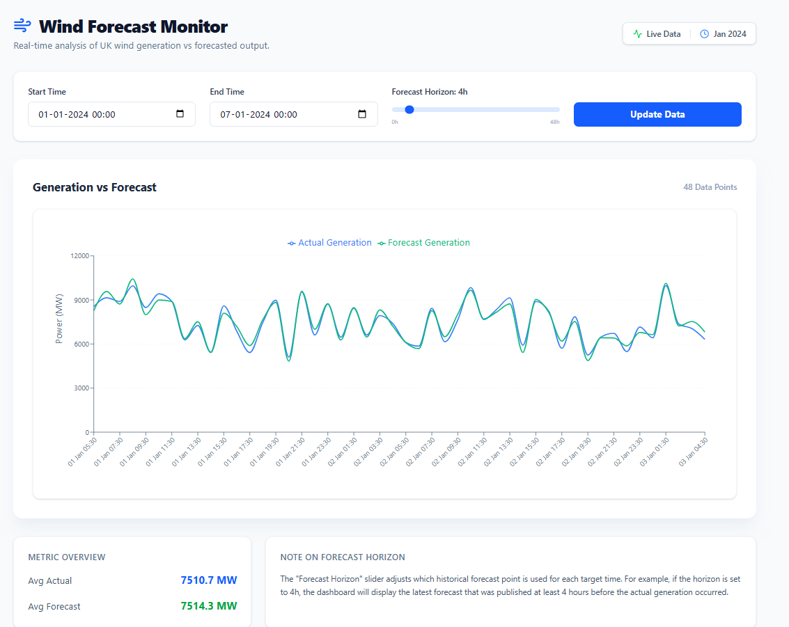

# Forecast Monitoring Web Application

## Project Overview
The **Forecast Monitoring Web Application** is a production-ready dashboard designed for monitoring and analyzing UK Wind Generation against historical forecasts. Utilizing the BMRS Elexon API, it provides real-time (and historical) insights into how accurately wind power generation was predicted versus the actual output recorded during January 2024.

**Live Link**: [https://forcast-moniter.vercel.app/](https://forcast-moniter.vercel.app/)

## Screenshots


## Tech Stack
*   **Frontend**: Next.js 15+ (App Router), React 19
*   **Styling**: TailwindCSS
*   **Charts**: Recharts (Responsive Line Charts)
*   **Icons**: Lucide React
*   **Data Handling**: Axios, Luxon (Time conversion & Timezone handling)
*   **Backend**: Next.js Serverless Functions (API Routes)

## Architecture
The application follows a modern serverless architecture optimized for Vercel:
*   **Data Source**: Directly fetches from BMRS Elexon API v1 (`FUELHH` for actuals, `WINDFOR` for forecasts).
*   **Serverless Flow**: The frontend makes requests to internal Next.js API Routes (`/api/merged-data`).
*   **Data Merging**: The backend logic automatically aligns "Actual" generation values with the specific "Forecast" that was published at a chosen horizon (e.g., 4 hours before the target time).

## Forecast Logic
The core value of this dashboard is the **Forecast Horizon** selector:
1.  **Target Time**: The specific half-hour window when wind power was generated.
2.  **Publish Time**: When the forecast was issued.
3.  **Horizon Logic**: Users can select a horizon (0-48h). The system finds the most recent forecast published *at least* X hours before the target time. This allows analysts to visualize how forecast accuracy improved or degraded as the target time approached.

## How to Run Locally
1.  Clone the repository.
2.  Navigate to the `frontend` directory:
    ```bash
    cd frontend
    ```
3.  Install dependencies:
    ```bash
    npm install
    ```
4.  Start the development server:
    ```bash
    npm run dev
    ```
5.  Open [http://localhost:3000](http://localhost:3000) in your browser.

---
*# AI Assistance

AI development tools were used for assistance during development (e.g., code suggestions, debugging, and documentation improvements).  
All architectural decisions, implementation, and analysis were performed by the author.*
